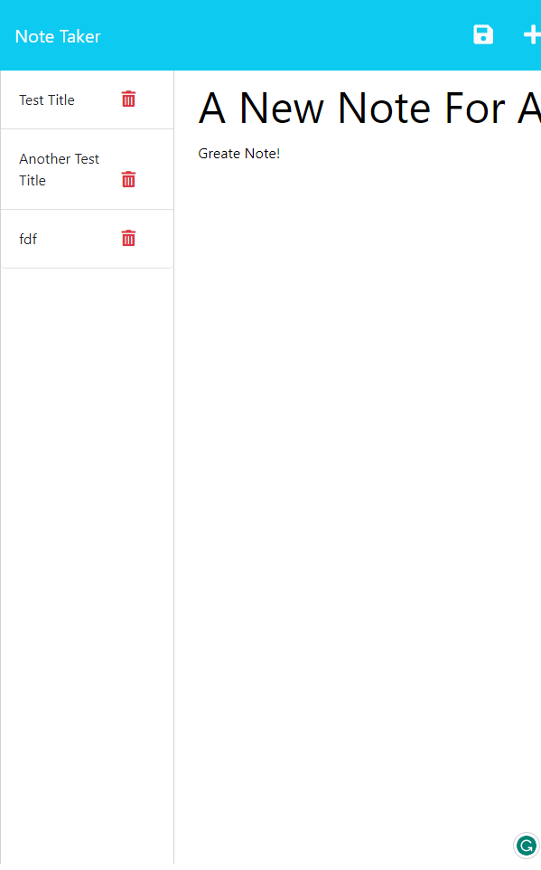

# Note Taker

## Description 
This application will allow users to create new notes, preview notes they've already made, as well as delete notes that are no longer needed.

## Installation 
From the command line: 
- npm install
- npm start

## Usage

## Credits 
N/A

## Questions
Any questions about this project? You can reach me here:
* Email: amsudekum@gmail.com
* GitHub: amsudekum https://github.com/amsudekum
